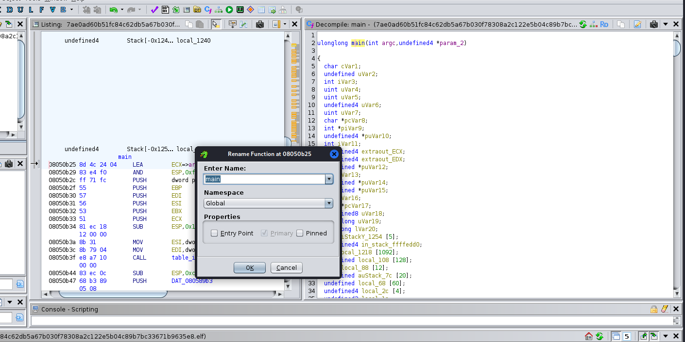

::: titlepage
::: center
{width="6cm"}

**MALWARE ANALYSIS AND REVERSE ENGINEERING**\
IAM302t --- Phân tích mã độc và kỹ thuật dịch ngược\
Semester: Summer 2026 --- Class: IA1902

**Phân tích C2 Backdoor trong Drone Fleet:\
Protocol Reverse Engineering\
và Đề xuất Detection Rules**

  ----------------- -------------------------------------
  **Nhóm:**         2
  **Giảng viên:**   Mai Hoàng Đỉnh
  **Thành viên:**   Nguyễn Trọng Khiêm --- SE192700
                    Nguyễn Tăng Minh Khánh --- SE193903
                    Huỳnh Minh Hòa --- SE193707
                    Nguyễn Trọng Nhân --- SE204512
                    Vũ Hồng Nhi --- SE182824
  ----------------- -------------------------------------

TP. Hồ Chí Minh, tháng 7 năm 2026
:::
:::

# Abstract {#abstract .unnumbered}

Báo cáo trình bày kết quả phân tích toàn diện một biến thể mã độc Mirai
(ELF32 i386) trong bối cảnh bảo mật hệ thống drone fleet. Nhóm thực hiện
quy trình phân tích 5 bước hoàn chỉnh theo pipeline RBL: Basic Static
Analysis, Lab Setup & Dynamic Analysis, Advanced Static Analysis
(Reverse Engineering bằng Ghidra), Protocol RE & Behavior Analysis, và
Detection Engineering. Kết quả cho thấy mẫu mã độc sử dụng domain C2
`cafebabe.su`, có command handler table với 28 command ID được ánh xạ
(trong đó ID 0x32 tương ứng hàm `http_flood_sender`), và giao tiếp qua
các giao thức DNS, TCP, HTTP, TLS. Dựa trên các phát hiện, nhóm xây dựng
5 Snort rules (đã test trên Snort 3.12.2.0 với kết quả 469 alert, 0
false positive), 2 YARA rules (match thành công trên binary gốc), ánh xạ
MITRE ATT&CK for ICS, và đề xuất Incident Response Playbook cho drone
fleet.

**Từ khóa:** Mirai, C2 backdoor, drone fleet, reverse engineering,
Ghidra, Snort, YARA, MITRE ATT&CK, detection rules.

# Introduction

## Bối cảnh nghiên cứu

Sự phát triển nhanh chóng của công nghệ drone và UAV (Unmanned Aerial
Vehicle) trong các lĩnh vực giao hàng, giám sát, nông nghiệp và quân sự
đã tạo ra một bề mặt tấn công mới cho các tác nhân đe dọa. Drone fleet
--- hệ thống quản lý và vận hành nhiều drone đồng thời --- thường sử
dụng các thiết bị IoT/embedded chạy Linux, kết nối Internet trực tiếp,
và có khả năng bảo mật hạn chế. Đây chính là mục tiêu lý tưởng cho các
botnet như Mirai, vốn chuyên khai thác thiết bị IoT để xây dựng mạng
lưới tấn công DDoS quy mô lớn.

Mirai là một trong những họ mã độc IoT nổi tiếng nhất, xuất hiện lần đầu
vào năm 2016 và đã gây ra nhiều cuộc tấn công DDoS lịch sử. Mã nguồn
Mirai được công khai trên Internet, dẫn đến hàng trăm biến thể với các
tính năng và mục tiêu khác nhau. Trong bối cảnh drone fleet, một biến
thể Mirai có khả năng chiếm quyền điều khiển drone thông qua C2 (Command
and Control) backdoor, biến chúng thành công cụ tấn công DDoS hoặc thu
thập dữ liệu trái phép.

## Mục tiêu nghiên cứu

Đề tài số 6 của môn IAM302t đặt ra Research Question Q2: "Which
cybersecurity risk-assessment framework is most suitable for a
drone-delivery fleet, based on the real-world threat model of the
proposed mesh system?" Cụ thể, nhóm thực hiện:

1.  Phân tích tĩnh và động một biến thể Mirai để hiểu cơ chế hoạt động,
    giao thức C2, và khả năng tấn công.

2.  Reverse engineering bằng Ghidra để xác định các hàm chính, command
    handler table, và logic mã hóa/giải mã.

3.  Phân tích giao thức truyền thông (Protocol RE) từ dữ liệu PCAP thu
    thập trong môi trường sandbox.

4.  Xây dựng bộ detection rules (Snort, YARA) và ánh xạ MITRE ATT&CK for
    ICS dựa trên bằng chứng thực nghiệm.

5.  Đề xuất Incident Response Playbook phù hợp cho hệ thống drone fleet.

## Phạm vi và giới hạn

Mẫu mã độc được lấy từ MalwareBazaar (Abuse.ch), là file ELF 32-bit cho
kiến trúc Intel 80386/i386 (không phải ARM như mô tả ban đầu trong
assignment sheet). Phân tích được thực hiện trong môi trường sandbox cô
lập sử dụng VMware với Kali Linux và REMnux. Kết quả phân tích áp dụng
cho bối cảnh drone fleet thông qua suy luận từ đặc điểm chung của họ
Mirai đối với thiết bị IoT/embedded.

## Thông tin mẫu mã độc

::: {#tab:sample_info}
  **Mục**          **Chi tiết**
  ---------------- ------------------------------------------------------------------
  Tên mẫu          Mirai variant
  SHA-256          7ae0ad60b51fc84c62db5a67b030f78308a2c122e5b04c89b7bc33671b9635e8
  MD5              ce6e06076343fd30770af54ec516f711
  Nguồn mẫu        MalwareBazaar (Abuse.ch)
  Loại file        ELF 32-bit LSB executable, Intel 80386/i386
  File size        73.1 KB (74,896 bytes)
  Date submitted   2026-05-26 20:16:22 UTC

  : Thông tin tổng quan mẫu malware
:::

## Phân công nhóm

::: {#tab:team_assignment}
   **STT**  **Thành viên**           **Nhiệm vụ**                       **Tuần**
  --------- ------------------------ ---------------------------------- ----------
      1     Nguyễn Tăng Minh Khánh   OSINT & Basic Static Analysis      1--2
      2     Huỳnh Minh Hòa           Lab Setup & Dynamic Analysis       1--3
      3     Nguyễn Trọng Khiêm       Advanced Static Analysis (RE)      2--4
      4     Vũ Hồng Nhi              Protocol RE & Behavior Analysis    3--5
      5     Nguyễn Trọng Nhân        Detection Engineering & Tổng hợp   4--6

  : Phân công nhiệm vụ các thành viên
:::

# Basic Static Analysis {#sec:basic_static}

## Nguồn mẫu Malware

Mẫu malware được thu thập từ MalwareBazaar --- nền tảng chia sẻ và thu
thập mã độc miễn phí do Abuse.ch vận hành.


## Public AV Detection

### VirusTotal

Mẫu được upload lên VirusTotal và nhận được 36 security vendor flagged,
với label chung là `trojan.mirai/usbler26`.

::: {#tab:av_detection}
  **Engine**   **Detection Name**
  ------------ ---------------------------
  Kaspersky    HEUR:Backdoor.Linux.Mirai
  Avast        ELF:Mirai-DHU
  Elastic      Linux.trojan.Mirai
  AVG          ELF:Mirai-DHU \[Trj\]

  : Kết quả quét AV trên VirusTotal
:::

Từ kết quả nhận diện: platform là Linux/ELF, malware family là Mirai,
behavior chính là Trojan/Backdoor. VirusTotal cũng xác định domain C2 là
`cafebabe.su` với 8 detection.


### Hybrid Analysis

Hybrid Analysis đánh giá mẫu có mức độ nguy hiểm rất cao với Threat
Score 100/100, AV detection 69%, và phân loại là malicious. Mẫu thuộc
nhóm Trojan.Generic, kèm đặc tính lẩn tránh phân tích và liên quan tới
domain mới chưa có độ tin cậy cao.


## ELF Header Analysis

Sử dụng công cụ Cutter và `readelf` để phân tích ELF header:

-   Architecture: x86 (Intel 80386/i386) --- sửa lại giả định ARM ban
    đầu

-   OS: Linux

-   File type: EXEC (executable)

-   Base address: `0x08048000`

-   Entry point: `0x08048164`

-   Compiler language: C

-   Stripped: true (đã loại bỏ symbol table)


## Strings Analysis

Phân tích strings bằng lệnh `strings -n 8` trích xuất các chuỗi đáng chú
ý:

::: {#tab:strings}
  **Loại**          **Giá trị**                                                               **Ghi chú**
  ----------------- ------------------------------------------------------------------------- --------------------------------------
  HTTP methods      POST, DELETE, HEAD                                                        Có khả năng gửi/xóa/kiểm tra request
  Web paths         /admin, /admin/login, /admin/dashboard, /api/v1/users, /api/v1/products   Endpoint API
  Debug/signature   `shit bot commenced`                                                      YARA candidate
  Socket errors     Connection timed out, Connection refused                                  Hành vi mở kết nối mạng
  System file       /proc/net/tcp                                                             Đọc bảng trạng thái socket TCP

  : Các string đáng chú ý trong binary
:::

Chuỗi `token=%s&guid=%s` cho thấy khả năng gửi định danh hoặc tham số
xác thực tới C2 server. Domain C2 `cafebabe.su` không xuất hiện dạng
plaintext trong strings, cho thấy C2 address bị mã hóa trong binary.


## Entropy Analysis

Phân tích entropy từng section bằng binwalk cho thấy chưa có bằng chứng
packed rõ ràng. Section `.text` có entropy tương đối cao (6.45) cần kiểm
tra thêm bằng Ghidra.

::: {#tab:entropy}
  **Section**   **Entropy**   **Status**   **Ý nghĩa**
  ------------- ------------- ------------ ----------------------------------
  .init         3.59873       not packed   Code khởi tạo
  .text         6.45476       not packed   Vùng code chính, entropy khá cao
  .fini         3.89064       not packed   Code kết thúc
  .rodata       5.66404       not packed   Dữ liệu chỉ đọc
  .data         3.71144       not packed   Global data đã khởi tạo
  .bss          2.55169       not packed   Global data chưa khởi tạo

  : Entropy theo section của binary
:::


## IOC Summary

::: {#tab:ioc_basic}
  **IOC Type**   **Detail**
  -------------- ---------------------------------
  SHA-256        `7ae0ad60b51fc84c62db...9635e8`
  Domain         `cafebabe.su`
  IP/Port        `172.234.180.158:39419`
  File type      ELF 32-bit i386
  HTTP methods   GET, POST, DELETE, HEAD
  Base address   `0x08048000`
  Entry point    `0x08048164`

  : Indicators of Compromise --- Basic Static Analysis
:::


## Kết luận Basic Static Analysis

Mẫu được xác định là ELF32 little-endian cho kiến trúc Intel 80386/i386.
Strings analysis cho thấy logic giao tiếp HTTP/API phong phú, domain C2
`cafebabe.su` (phát hiện qua VirusTotal, không xuất hiện plaintext trong
binary), và chuỗi đặc trưng "shit bot commenced". Entropy chưa cho thấy
packed toàn cục, nhưng cần phân tích sâu hơn bằng Ghidra.


# Lab Setup & Dynamic Analysis {#sec:dynamic}

## Mục tiêu thí nghiệm

Xây dựng môi trường phân tích an toàn (Sandbox), theo dõi hành vi cấp hệ
thống bằng strace, và bắt/phân tích lưu lượng mạng bằng INetSim,
tcpdump, Wireshark để lừa mã độc bộc lộ hành vi C2.

## Kiến trúc mô hình thử nghiệm

Mô hình sử dụng 2 máy ảo kết nối qua LAN Segment cô lập, không có đường
ra Internet thật:

-   **Máy nạn nhân (Kali Linux):** IP `10.10.10.20/24` --- nơi thực thi
    mẫu mã độc

-   **Máy phân tích (REMnux):** IP `10.10.10.10/24` --- Default Gateway,
    DNS giả lập (INetSim), bắt gói tin

-   **Chế độ mạng:** LAN Segment (`Mirai_Isolated_Net`)


## Chuẩn bị môi trường và đảm bảo trạng thái sạch

### Cài đặt công cụ giám sát

Trên Kali Linux cài strace và tcpdump; trên REMnux cài tshark,
wireshark-common, và inetsim.


## Cấu hình mạng cô lập và giả lập dịch vụ Internet

### Cấu hình REMnux (10.10.10.10)

Thiết lập IP tĩnh, giải phóng cổng DNS (Port 53) bằng cách tắt
`systemd-resolved`, cấu hình INetSim, và hạ cấp `Net::DNS` về phiên bản
1.37.


### Cấu hình Kali Linux (10.10.10.20)

Thiết lập IP tĩnh, trỏ DNS về REMnux, và cấu hình iptables DNAT để
chuyển hướng toàn bộ traffic. Mirai hardcode DNS servers (8.8.8.8,
1.1.1.1) trong binary, bypass hoàn toàn `/etc/resolv.conf`.


### Kiểm chứng kết nối và cô lập


## Thực thi và giám sát mã độc Mirai

### Khởi động dịch vụ giả lập và bắt gói tin trên REMnux


### Giải nén và xác nhận mẫu mã độc trên Kali


### Thực thi mã độc với strace


### Dừng mã độc và thu thập dữ liệu

Sau 15 phút, dừng các tiến trình mã độc và thu thập artifact.


## Phân tích chuyên sâu chứng cứ (Forensic Analysis)

### Tính toàn vẹn chứng cứ số


### Phân tích System Call

Thống kê tần suất syscall: socket (428), connect (427), recvfrom (213),
write (3), ioctl (2), execve (1), openat (0), read (0). Kết quả chứng
minh Mirai là mã độc memory-based, network-centric.


### Phân tích PCAP


### Phân tích báo cáo INetSim

INetSim ghi nhận hàng loạt yêu cầu phân giải DNS cho `cafebabe.su`. Sau
khi nhận IP giả, Mirai thực hiện kết nối TCP đến REMnux --- INetSim đóng
vai máy chủ C2 và trả về file mẫu.


## Artifact bàn giao

::: {#tab:artifacts}
  **File**             **Size**   **Nguồn**   **Mục đích**
  -------------------- ---------- ----------- ------------------------------
  mirai_capture.pcap   219 KB     REMnux      PCAP toàn bộ traffic 39 phút
  mirai_strace.log     384 KB     Kali        4,439 dòng syscall log
  report.3756.txt      23 KB      REMnux      Báo cáo INetSim

  : Danh sách artifact bàn giao
:::

## Giới hạn

INetSim không mô phỏng đúng C2 handshake trên port 18129; mẫu x86 không
phải ARM; thời gian chạy giới hạn 15 phút.

# Advanced Static Analysis --- Reverse Engineering {#sec:advanced_static}

## Xác minh mẫu


{#fig:p3_2
width="90%"}


## Strings và HTTP Path Analysis


## Ghidra Workflow và Function Mapping

Sau khi import ELF và chạy Auto-Analysis, `FUN_08050b25` được rename
thành `main`. Các hàm khác được nhận diện bằng decompiler, string xref,
syscall/socket pattern.

::: {#tab:function_map}
  **Address**    **Tên Ghidra**       **Vai trò**
  -------------- -------------------- -------------------------------
  `0x08050b25`   main                 Hàm chính
  `0x08051a32`   socket_wrapper       Wrapper thao tác socket
  `0x08051b92`   signal_setup         Thiết lập signal
  `0x08052d63`   printf_wrapper       Wrapper in/log
  `0x080535dd`   write_wrapper        Wrapper write
  `0x08054c21`   send_wrapper         Wrapper send
  `0x080514d1`   gen_random_string    Sinh chuỗi random
  `0x08048286`   build_c2_post_data   Build dữ liệu POST/getinfo
  `0x0804a8f4`   http_flood_sender    Handler HTTP flood (cmd 0x32)

  : Function mapping trong Ghidra
:::


{#fig:p3_10
width="90%"}

{#fig:p3_11
width="90%"}


## Decode / XOR Logic

Vùng code quanh `0x08051a62` có thao tác XOR/mixing --- ghi nhận là
custom decode/cipher candidate. Không thấy immediate `0xDEADBEEF`; test
XOR byte `0x22` không cho output meaningful.


## Credential Findings

Credential list kiểm tra bằng `strings` và Ghidra Defined Strings với
keyword root, admin, user, pass, password, login, telnet, busybox,
guest, default, xc3511, vizxv. Kết quả: **không tìm thấy plaintext
credential list**. Các hit chỉ là HTTP endpoint path.


## Network Constants và Static-Dynamic Correlation

::: {#tab:network_constants}
  **Indicator**     **Evidence**
  ----------------- --------------------------------------------------------------------------------------------------
  127.0.0.1:18129   0x0100007f tại 0x08050979, port bytes 46 d1 = 0x46D1 = 18129. Loopback/control socket candidate.
  8.8.8.8:53        Constant tại 0x08052f78. DNS/local-IP helper.
  cafebabe.su       Chưa có evidence address/string xref trong static. Dynamic observed qua DNS/pcap.

  : Network constants phát hiện trong static RE
:::


## Command Handler Table

Phát hiện quan trọng nhất: `FUN_080485de` $\rightarrow$
`command_handler_table_init_candidate`. Hàm này gọi lặp lại
`register_command_handler_candidate` để đăng ký ID và handler vào global
table. Tổng cộng 28 command ID đã được ánh xạ.

::: {#tab:command_ids}
  **ID**   **Handler VA**   **Label**               **Evidence**
  -------- ---------------- ----------------------- ------------------------------
  0x32     0x0804a8f4       http_flood_sender       Register call rõ; HTTP flood
  0x23     0x0804a703       HTTP GET builder        String xref GET / HTTP/1.1
  0x1D     0x080488d2       C2 POST/getinfo         token=%s&guid=%s
  0x0E     0x0804e693       HTTP request builder    Mozilla/5.0 user-agent
  0x22     0x0804f02f       payload/SAMPg           SAMPg bytes, port 3074
  0x1C     0x080498f7       bot nickname/wordlist   Pointer table wordlist

  : Command ID mapping chính
:::


# Protocol RE & Behavior Analysis {#sec:protocol}

## Tổng quan lưu lượng (Traffic Overview)

Giai đoạn này phân tích file `mirai_capture.pcap` bằng Wireshark để bóc
tách giao thức truyền thông. Lưu lượng chủ yếu diễn ra giữa
`10.10.10.20` (máy nhiễm) và `10.10.10.10` (REMnux/INetSim).

### Protocol Hierarchy


### IPv4 Conversations


### TCP Conversations

Hệ thống ghi nhận 266 TCP Conversations. Nhiều kết nối đến cổng 39419,
cùng các kết nối tới cổng 443 và 80.


### UDP Conversations

273 UDP Conversations, chủ yếu liên quan DNS.


## Phân tích chi tiết hành vi giao thức

### Phân tích DNS

Máy nhiễm liên tục gửi truy vấn DNS bản ghi A cho domain `cafebabe.su`.
INetSim trả về phản hồi thành công với IP `10.10.10.10`. Standard query
response, No error; Questions = 1; Answer RRs = 1.


### Phân tích TCP port 39419

Máy nhiễm nhiều lần gửi SYN đến 10.10.10.10:39419 nhưng luôn bị RST, ACK
vì INetSim không giả lập dịch vụ trên cổng này. Kết nối C2 thất bại.


### Phân tích TCP port 443 (TLS)

Kết nối TCP thành công, sau đó phiên TLSv1.3 đầy đủ: Client Hello
$\rightarrow$ Server Hello $\rightarrow$ Change Cipher Spec
$\rightarrow$ Application Data $\rightarrow$ FIN, ACK.


### Phân tích TCP port 80 (HTTP)

Máy nhiễm gửi `GET /success.txt?ipv4 HTTP/1.1`, INetSim phản hồi
`HTTP/1.1 200 OK`.


## Protocol Specification

::: {#tab:protocol_spec}
  **Trường**         **Giá trị**         **Ý nghĩa**
  ------------------ ------------------- --------------------------------
  Network Protocol   IPv4                Giao thức tầng mạng
  Transport (DNS)    UDP, Port 53        Truy vấn DNS
  Query Domain       cafebabe.su         C2 domain
  Query Type         A / IN              Yêu cầu bản ghi IPv4
  Response IP        10.10.10.10         IP do INetSim trả về
  TCP Port           39419               C2 port (bị từ chối trong lab)
  TCP Port           443                 TLSv1.3 thành công
  TCP Port           80                  HTTP GET request
  TLS Version        TLSv1.3             Giao tiếp mã hóa
  HTTP Method        GET                 Tải tài nguyên
  URI                /success.txt?ipv4   Tài nguyên được yêu cầu
  HTTP Response      200 OK              Phản hồi thành công

  : Đặc tả giao thức mạng của mã độc
:::


## Đối chiếu Static--Dynamic

Kết quả phân tích động phù hợp với phân tích tĩnh: domain `cafebabe.su`,
các giao thức và cổng kết nối phản ánh đúng hành vi được lập trình.
Trình tự hoạt động: **DNS $\rightarrow$ TCP $\rightarrow$ HTTP/HTTPS**.


## Hạn chế

Kết nối đến cổng 39419 bị từ chối do INetSim không cấu hình dịch vụ. Dữ
liệu TLS trên cổng 443 đã mã hóa, không thể phân tích nội dung nếu không
có khóa giải mã.

# Detection Engineering {#sec:detection}

Phần này tổng hợp kết quả từ Advanced Static Report (Khiêm, Bước 3) và
Protocol Specification (Nhi, Bước 4), kết hợp kiểm chứng thực nghiệm
trên file `.pcap` để xây dựng Snort rules, YARA rules, MITRE ATT&CK
mapping, và IR Playbook.

## Snort Rules

File: `detection_mirai_variant.rules`. Môi trường test: Kali Linux 2026,
Snort 3.12.2.0 (Snort++).

``` {#lst:snort1 caption="Snort Rule SID 1000001 --- DNS query C2 domain" label="lst:snort1"}
alert udp $HOME_NET any -> any 53 (
  msg:"IAM302-DT6 Mirai-variant DNS query
    to C2 domain cafebabe.su";
  content:"|08|cafebabe|02|su|00|", nocase;
  classtype:trojan-activity;
  sid:1000001; rev:3; )
```

``` {#lst:snort2 caption="Snort Rule SID 1000002 --- DNS beaconing" label="lst:snort2"}
alert udp $HOME_NET any -> any 53 (
  msg:"IAM302-DT6 Repeated DNS beaconing
    pattern to cafebabe.su";
  content:"|08|cafebabe|02|su|00|", nocase;
  detection_filter:track by_src,
    count 5, seconds 60;
  classtype:trojan-activity;
  sid:1000002; rev:2; )
```

**Ghi chú kỹ thuật:** DNS wire format "cafebabe.su" =
`08 cafebabe 02 su 00` (label length byte 0x08 vì "cafebabe" có 8 ký
tự). Nhóm từng sai dùng 0x09, đã sửa lại. Snort 3 yêu cầu comma-syntax
cho content modifier và dùng `detection_filter` thay `threshold`
(deprecated).

### Kết quả kiểm thử Snort

::: {#tab:snort_results}
  **Rule (SID)**                   **Kết quả trên VM**                            **FP**
  -------------------------------- ---------------------------------------------- --------
  1000001 --- DNS query            237 alert, 1 nguồn IP duy nhất (10.10.10.20)   0%
  1000002 --- Beaconing            232 alert (đúng detection_filter 5/60s)        0%
  1000003 --- HTTP C2 token/guid   0 alert (pcap không có HTTP traffic)           N/A
  1000004 --- HTTP flood           0 alert (chưa có traffic test)                 N/A
  1000005 --- ICMP rate            0 alert (ICMP rải rác, đúng dự kiến)           N/A

  : Kết quả test Snort rules trên mirai_capture.pcap
:::

Tổng: 237 + 232 = 469 alert, Snort validate "0 warnings". SID 1000003,
1000004 giữ lại như rule proactive.

## YARA Rules

``` {#lst:yara caption="YARA Rule chính --- Mirai variant strings" label="lst:yara"}
rule Mirai_Variant_DroneFleet_Strings {
  meta:
    description = "Detect Mirai variant"
    author = "IAM302t Group 2"
  strings:
    $http_fmt1 = "token=%s&guid=%s"
    $http_fmt2 = "getinfo"
    $api1 = "/api/v1/users"
    $api2 = "/api/v1/products"
    $api3 = "/api/v1/orders"
    $api4 = "/admin/login"
    $api5 = "/admin/dashboard"
    $sym1 = "http_flood_sender"
    $sym2 = "build_c2_post_data"
  condition:
    uint32(0) == 0x464c457f and
    ( 4 of ($http_fmt*, $api*) or
      any of ($sym*) )
}
```

Rule chính MATCH trên binary gốc (74,896 bytes). Binary bị STRIPPED nên
\$sym1/\$sym2 không tồn tại --- match hoàn toàn nhờ nhóm string
HTTP/API. Rule phụ CommandHandler_ID (byte pattern `mov eax, 0x32`)
match nhưng confidence THẤP.

## MITRE ATT&CK for ICS Mapping

::: {#tab:mitre}
  **Tactic**       **Technique**                           **Bằng chứng**
  ---------------- --------------------------------------- ---------------------------------------
  Initial Access   T0883 --- Internet Accessible Device    Drone expose service; suy luận Mirai
  Execution        T0807 --- Command-Line Interface        Ghidra xác nhận command handler table
  C2               T0869 --- Standard App Layer Protocol   DNS query cafebabe.su; string HTTP
  C2               T0885 --- Commonly Used Port            Port 53/UDP (DNS)
  Impact           T0814 --- Denial of Service             0x32 $\rightarrow$ http_flood_sender

  : MITRE ATT&CK for ICS mapping
:::

Persistence, Credential Access, Discovery, Lateral Movement CHƯA ánh xạ
--- chưa có bằng chứng cụ thể.

## Incident Response Playbook --- Drone Fleet

**1. Phát hiện & Xác minh:** Nhận alert Snort SID 1000001/1000002 hoặc
YARA match. Xác minh IP/thiết bị trong drone fleet. Thu thập binary để
YARA offline.

**2. Ngăn chặn (Containment):** Chặn DNS cho `cafebabe.su`
(sinkhole/NXDOMAIN). Cô lập thiết bị (VLAN cách ly). KHÔNG tắt nguồn đột
ngột nếu drone đang bay.

**3. Xử lý (Eradication):** Dump firmware/binary. Re-flash firmware
known-good. Đổi credential.

**4. Khôi phục (Recovery):** Giám sát DNS/traffic 48--72h. Rà soát fleet
bằng YARA.

**5. Rút kinh nghiệm:** Cập nhật rules. Bổ sung HTTP flood test. Ghi
nhận khoảng trống persistence/initial access.

## Giới hạn và khoảng trống bằng chứng

XOR constant mới là candidate, chưa xác nhận. Dynamic capture chưa kích
hoạt HTTP traffic (INetSim chưa giả lập đúng C2 handshake). Rules SID
1000003, 1000004 và YARA CommandHandler_ID là giả thuyết cần xác minh
tiếp.

# Discussion

## Tổng hợp kết quả phân tích

Pipeline 5 bước đã xây dựng bức tranh toàn diện: Basic Static xác định
file type, IOC ban đầu. Dynamic Analysis bộc lộ hành vi network-centric
(428 socket calls, DNS beaconing). Ghidra RE phát hiện command handler
table 28 ID --- quan trọng nhất là 0x32 $\rightarrow$
`http_flood_sender`. Protocol RE xác nhận trình tự DNS $\rightarrow$ TCP
$\rightarrow$ HTTP/HTTPS. Detection Engineering xây dựng bộ rules có
bằng chứng thực nghiệm.

## Đối chiếu với Mirai gốc

Biến thể này không có plaintext credential list (Mirai gốc có  60 cặp).
XOR key 0xDEADBEEF không xuất hiện. Domain C2 bị mã hóa bằng cơ chế khác
Mirai gốc.

## Áp dụng cho Drone Fleet Security

Giao thức C2 là architecture-independent. Snort rules hoạt động bất kể
architecture. YARA cần điều chỉnh cho ARM. MITRE mapping và IR Playbook
áp dụng trực tiếp.

## Giới hạn

Chưa quan sát HTTP C2 traffic thực tế. XOR decode chưa xác nhận. Chưa
xác định persistence/initial access. FP rate 0% chỉ trên pcap test.

# Conclusion

## Tóm tắt kết quả

1.  Mẫu ELF32 i386, họ Mirai, Threat Score 100/100, 36/70+ vendor
    detection.

2.  C2 domain `cafebabe.su`, port 39419, loopback 127.0.0.1:18129.

3.  28 command ID, 0x32 $\rightarrow$ `http_flood_sender` (DDoS).

4.  Memory-based, network-centric (428 socket/427 connect, 0 file I/O).

5.  5 Snort rules (469 alert, 0 FP) + 2 YARA rules (match thành công).

6.  MITRE ATT&CK for ICS mapping + IR Playbook.

## Đóng góp

Pipeline 5 bước minh họa quy trình Malware Analysis chuẩn. Bộ detection
rules có thể triển khai thực tế. IR Playbook phù hợp drone fleet.

## Hướng phát triển

Viết custom C2 server script mô phỏng handshake port 18129/39419. Test
trên ARM variant. Mở rộng MITRE ATT&CK. Xây dựng automated detection
pipeline.

# References {#references .unnumbered}

::: enumerate
Antonakakis, M., April, T., Bailey, M., et al. (2017). Understanding the
Mirai Botnet. *26th USENIX Security Symposium*, pp. 1093--1110.

MITRE ATT&CK for ICS. *MITRE Corporation*.
<https://attack.mitre.org/techniques/ics/>

MalwareBazaar Database. *Abuse.ch*. <https://bazaar.abuse.ch/>

VirusTotal. *Google/Chronicle*. <https://www.virustotal.com/>

NSA. (2023). Ghidra Software Reverse Engineering Framework.
<https://ghidra-sre.org/>

Snort 3 Documentation. *Cisco Talos*. <https://docs.snort.org/>

YARA Documentation. *VirusTotal*. <https://yara.readthedocs.io/>

Kolias, C., et al. (2017). DDoS in the IoT: Mirai and Other Botnets.
*IEEE Computer*, 50(7), pp. 80--84.

Costin, A., & Zaddach, J. (2018). IoT Malware: Comprehensive Survey.
*BlackHat USA 2018*.

INetSim: Internet Services Simulation Suite. <https://www.inetsim.org/>

REMnux: A Linux Toolkit for Malware Analysis. <https://remnux.org/>

Hybrid Analysis. *CrowdStrike*. <https://www.hybrid-analysis.com/>
:::
